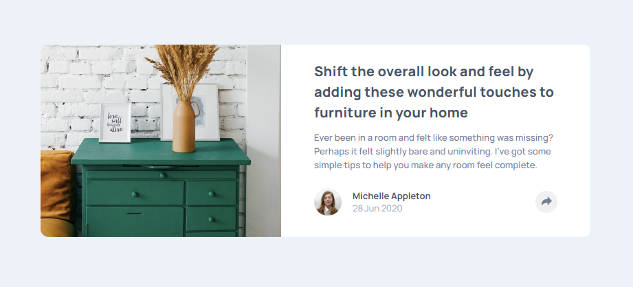
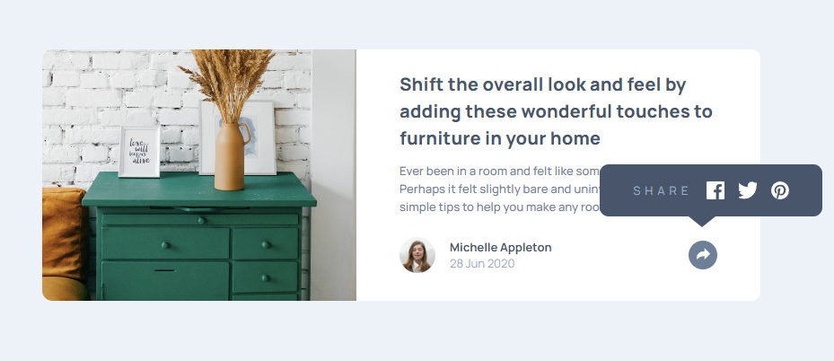
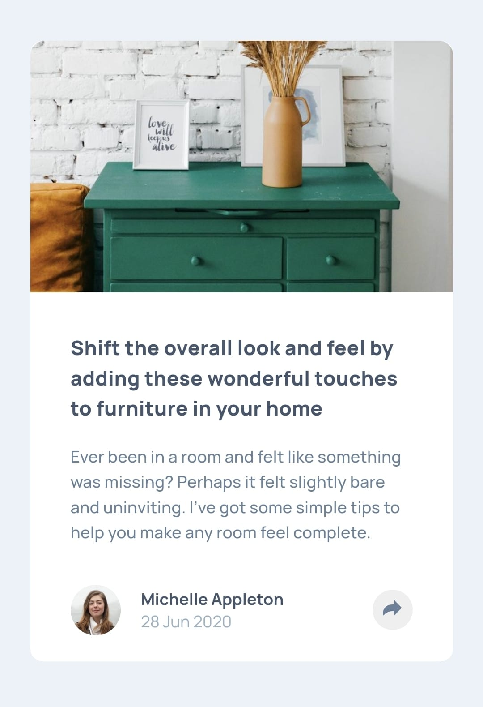
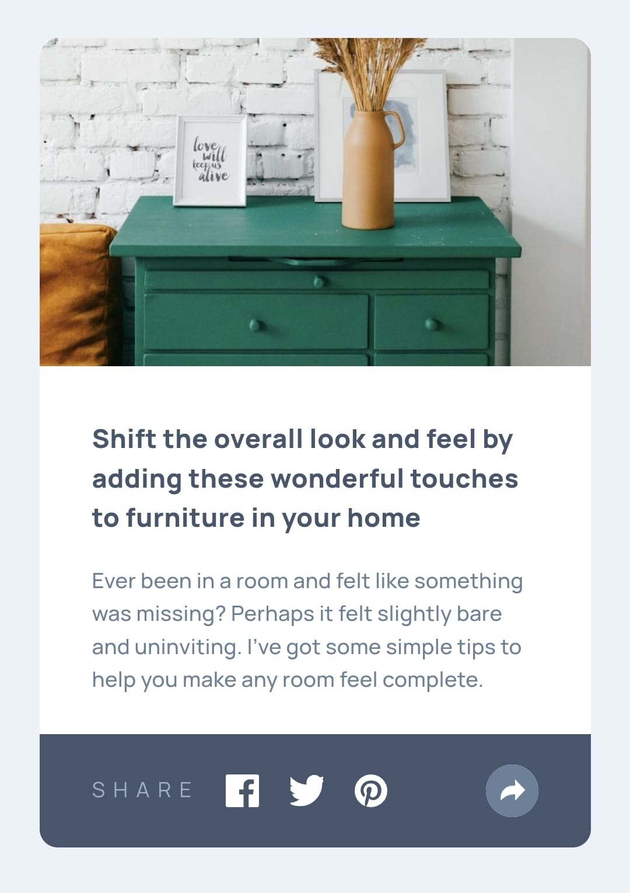

# Frontend Mentor - Article preview component solution

This is a solution to the [Article preview component challenge on Frontend Mentor](https://www.frontendmentor.io/challenges/article-preview-component-dYBN_pYFT). Frontend Mentor challenges help you improve your coding skills by building realistic projects. 

## Table of contents

- [Overview](#overview)
  - [The challenge](#the-challenge)
  - [Screenshot](#screenshot)
  - [Links](#links)
- [My process](#my-process)
  - [Built with](#built-with)
  - [What I learned](#what-i-learned)
  - [Continued development](#continued-development)
- [Author](#author)

## Overview

### The challenge

Users should be able to:

- View the optimal layout for the component depending on their device's screen size
- See the social media share links when they click the share icon

### Screenshot

### Links

- Solution URL: [GitHub](https://github.com/DrakeHermit/article-preview-component)
- Live Site URL: [Live Site](https://drakehermit-article-preview.netlify.app/)

## My process

I started with HTML and CSS, and then I moved onto making the links popup on mobile phones first with JS. After that I finished the CSS for desktop devices and made the links popup interactively.

### Built with

- Semantic HTML5 markup
- CSS custom properties
- Flexbox
- Mobile-first workflow
- JavaScript

### What I learned

I learned quite a bit actually, mostly JS. I learned how to check for the size of the viewport and make something happen with JS based on that. Also with CSS I learned how to make a triangle as a pseudo element.

### Continued development

I gotta keep on learning JS at this stage and refine my HTML and CSS skills too.

## Author

- Frontend Mentor - [@DrakeHermit](https://www.frontendmentor.io/profile/DrakeHermit)